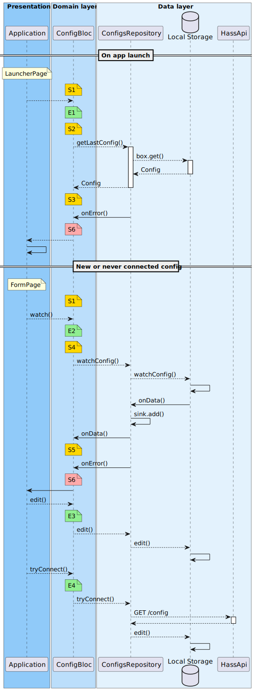

# First configuration worflow 

Ce document présente la configuration de la connexion au serveur Home Assistant et le comportement attendu.

Notre architecture est basés sur le système de gestion d'état [Bloc](https://bloclibrary.dev/). L'objectif de ce document est donc de présenter :

- Les objets solicités durant ce workflow
- Les flux de donné
- Les événements déclenchés
- Les états émis
- Les impacts sur l'UI

## Comportement

Une _configuration_ est l'objet contenant toutes les informations pour identifier un serveur _Home Hassistant_ et s'y connecter.

Durant l'affichage du _splash screen_, l'application charge la dernière configuration utilisée. Elle contrôle la présence d'une date de connection attestant de sa validité. Lors du premier lancement de l'application, une configuration "vide" est créée. Si la configuration n'est pas valide l'utilisateur est redirigé vers le formulaire d'édition. Si elle est valide l'il est redirigé vers son dashboard.

## diagramme de séquence

Ce diagramme présente les échanges réalisés au lancement de l'application avec une configuration non valide.

## Les événements

Voici les différents événements pouvant être émis durant l'authentification.

|    | Class | Propriétés |
|----|-------|------------|
| E1 | GetLastConfig   | |
| E2 | WatchLastConfig | |
| E3 | UpdateConfig    | `Config config` |
| E4 | TryConnect      | `Config config` |

## Les états

Voici les différents états pouvant être émis durant l'authentification.

|    | Class | Propriétés |
|----|-------|------------|
| S1 | Initial    | |
| S2 | Loading    | |
| S3 | Loaded     | `Config config` |
| S4 | Subscribing | |
| S5 | Listening  | `Config config` |
| S6 | Error      | `Exception failure` |