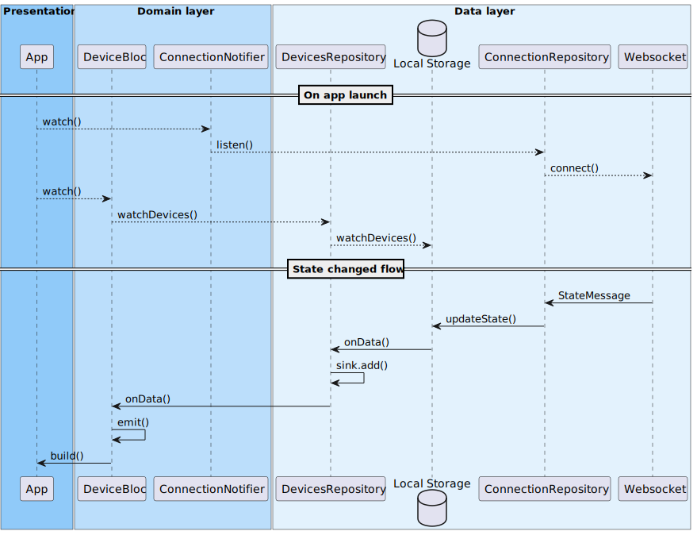
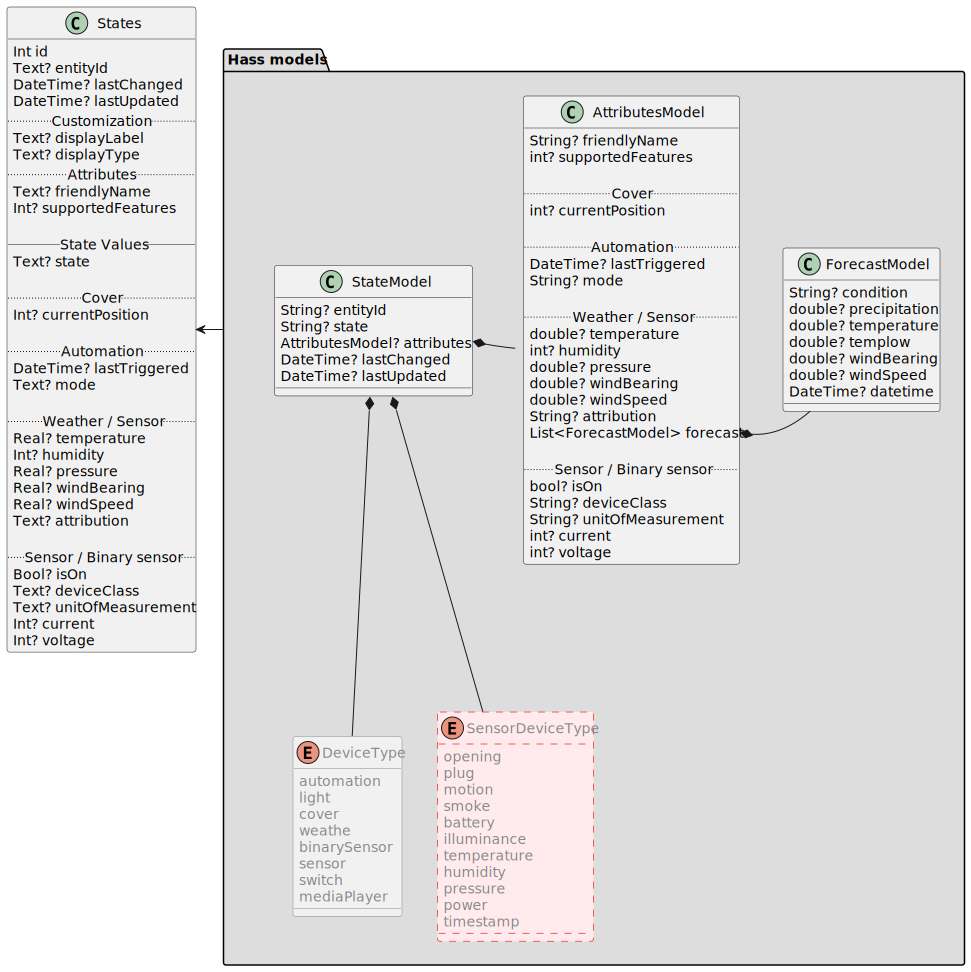

# States management 

Ce document présente la gestion des états et le comportement attendu.

Notre architecture est basés sur le système de gestion d'état [Bloc](https://bloclibrary.dev/). L'objectif de ce document est donc de présenter :

- Les objets solicités durant ce workflow
- Les flux de donné
- Les événements déclenchés
- Les états émis
- Les impacts sur l'UI

## Comportement attendu

Les changements d'état d'un équipement sont déclenchés part une notification reçu via la connexion WebSocket avec le serveur Home Assistant. Au lancement de l'application celle-ci se connecte à Home Assistant et se met à l'écoute des évennements. D'un autre côté, chaque élément de l'UI charge les données stockées en local et souscrit aux changements de valeur. Lorsque le serveur signale un changement d'état, la source de donnée locale est mise à jour avec la nouvelle valeur. Chaque couche de l'architecture étant connecté de manière réactive, la nouvelle donnée est remontée jusque l'UI pour y être affichée.

## Data flows

## Models

